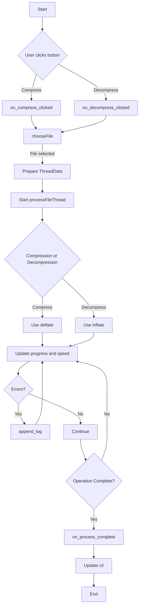

# Features

This program is a GUI application that uses the zlib library to compress and decompress files. The main features include:

- **File Compression**: Compresses selected files into the `.gz` format.
- **File Decompression**: Decompresses `.gz` files back to their original format.
- **Progress Display**: Shows real-time progress through a progress bar during compression or decompression.
- **File Information**: Displays information such as file name, size, and compression ratio.
- **Processing Speed Display**: Shows the speed of processing in bytes per second.
- **Log Viewer**: Displays messages and errors that occur during processing in a log viewer.
- **Cross-Platform Support**: Designed to work on both Windows and Linux systems.

---

# Functions

The main functions of the program and their roles are as follows:

- **`main`**: Initializes GTK and creates the main window and widgets, then starts the event loop.
- **`on_compress_clicked`**: Called when the "File Compress" button is clicked; initiates the file selection and compression process.
- **`on_decompress_clicked`**: Called when the "File Decompress" button is clicked; initiates the file selection and decompression process.
- **`chooseFile`**: Opens a file chooser dialog to allow the user to select a file.
- **`processFileThread`**: Performs the file compression or decompression in a separate thread.
- **`update_progress`**: Updates the progress bar to reflect the current progress of the operation.
- **`update_label`**: Updates labels to display file information or status messages.
- **`update_log`**: Adds new messages to the log viewer.
- **`append_log`**: Queues a log message to be added to the log viewer from the UI thread.
- **`on_process_complete`**: Called upon completion of the processing; updates the UI and frees memory.

---

# How it Works

This program is a GUI application built with GTK that allows users to compress and decompress files through user interactions.

1. **File Selection**: When the user clicks the "File Compress" or "File Decompress" button, the `chooseFile` function is called to display a file chooser dialog.

2. **Operation Initiation**: After selecting a file, the `on_compress_clicked` or `on_decompress_clicked` function stores necessary information in a `ThreadData` structure and starts the `processFileThread` function in a new thread.

3. **File Processing**:
   - The `processFileThread` function uses zlib's `deflate` (for compression) or `inflate` (for decompression) functions to process the file.
   - During processing, `update_progress` is called to update the progress bar, and processing speed is calculated and displayed.
   - If any issues occur, `append_log` adds messages to the log viewer.

4. **Completion**:
   - Upon completion, `on_process_complete` is called to update the progress bar to 100% and display final information such as compression ratio.
   - Memory is freed, and the UI is updated accordingly.

5. **UI Updates**:
   - The GTK `g_idle_add` function is used to safely request UI updates from the worker thread to the main UI thread.

### Visualization with Mermaid

---

# How to Use

1. **Run the Program**:
   - Compile and run the program from the terminal.
   - Ensure that necessary libraries (GTK, zlib, etc.) are installed.

2. **File Compression**:
   - Click the "File Compress" button on the main screen.
   - Select the file you wish to compress from the file chooser dialog.
   - The selected file will be compressed into a `.gz` file.
   - The progress bar and speed information will update in real-time.

3. **File Decompression**:
   - Click the "File Decompress" button on the main screen.
   - Select the `.gz` file you wish to decompress.
   - The file will be decompressed to its original format.
   - The progress bar and speed information will update in real-time.

4. **Monitor the Operation**:
   - Use the progress bar to check the current progress.
   - View messages or errors in the log viewer during processing.
   - After completion, file information and compression ratio will be displayed.

5. **Notes**:
   - When compressing, the output file will have the original filename with a `.gz` extension added.
   - When decompressing, only files with a `.gz` extension can be selected, and they will be restored to their original extension.
   - Processing large files may take a significant amount of time.

---