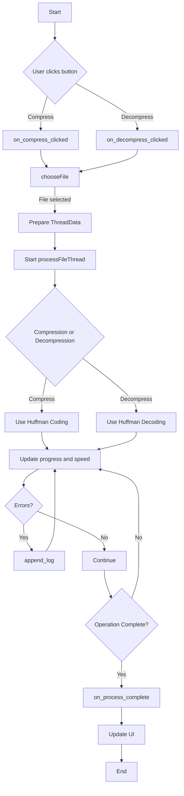

# Features

This program is a GUI application that uses Huffman coding to compress and decompress files. The main features include:

- **File Compression**: Compresses selected files into the `.adv` format.
- **File Decompression**: Decompresses `.adv` files back to their original format.
- **Progress Display**: Shows real-time progress through a progress bar during compression or decompression.
- **File Information**: Displays information such as file name, size, and compression ratio.
- **Processing Speed Display**: Shows the speed of processing in bytes per second.
- **Log Viewer**: Displays messages and errors that occur during processing in a log viewer.
- **Cross-Platform Support**: Designed to work on both Windows and Linux systems.

---

# Functions

The main functions of the program and their roles are as follows:

- **`main`**: Initializes GTK, creates the main window and widgets, and starts the event loop.
- **`on_compress_clicked`**: Called when the "File Compress" button is clicked; initiates the file selection and compression process.
- **`on_decompress_clicked`**: Called when the "File Decompress" button is clicked; initiates the file selection and decompression process.
- **`chooseFile`**: Opens a file chooser dialog to allow the user to select a file, utilizing the native file explorer of the operating system.
- **`processFileThread`**: Performs the file compression or decompression in a separate thread to keep the UI responsive.
- **`update_progress`**: Updates the progress bar to reflect the current progress of the operation.
- **`update_label`**: Updates labels to display file information or status messages.
- **`update_log`**: Adds new messages to the log viewer.
- **`append_log`**: Queues a log message to be added to the log viewer from the UI thread using `g_idle_add`.
- **`on_process_complete`**: Called upon completion of the processing; updates the UI, displays compression ratio, and frees allocated memory.

---

# How it Works

This program is a GUI application built with GTK that allows users to compress and decompress files through user interactions.

1. **File Selection**:
   - When the user clicks the "File Compress" or "File Decompress" button, the `chooseFile` function is invoked.
   - Depending on the operating system, it utilizes the native file chooser dialog (e.g., Windows Explorer on Windows or Finder on macOS) to allow the user to select the desired file.

2. **Operation Initiation**:
   - After selecting a file, either `on_compress_clicked` or `on_decompress_clicked` is called based on the button clicked.
   - These functions prepare a `ThreadData` structure containing necessary information such as input and output file paths, UI components for updates, and operation type (compress or decompress).
   - A new thread is then started to handle the compression or decompression process, ensuring that the GUI remains responsive.

3. **File Processing**:
   - The `processFileThread` function reads the entire file into memory.
   - For compression:
     - It calculates the frequency of each byte in the file.
     - Builds a Huffman tree based on these frequencies.
     - Generates Huffman codes for each unique byte.
     - Encodes the file data using these Huffman codes with bit-packing.
     - Prepares the compressed data by storing the Huffman tree information followed by the encoded data.
   - For decompression:
     - It reads the Huffman tree information from the compressed file.
     - Reconstructs the Huffman tree.
     - Decodes the bit-packed data to retrieve the original file content.
   - Throughout the process, `update_progress` is periodically called to update the progress bar and display the processing speed.
   - Any errors or important messages are sent to the log viewer using `append_log`.

4. **Completion**:
   - Once the compression or decompression is complete, `on_process_complete` is called.
   - This function updates the progress bar to 100%, logs the completion message, calculates and displays the compression ratio, and updates the status label.
   - It also ensures that all allocated memory is properly freed to prevent memory leaks.

5. **UI Updates**:
   - The GTK `g_idle_add` function is used to safely request UI updates from the worker thread to the main UI thread.
   - This ensures that all UI modifications occur in the main thread, maintaining thread safety and preventing potential race conditions.

### Visualization with Mermaid



---

# How to Use

1. **Run the Program**:
   - **Compilation**:
     - Ensure that you have GTK and the necessary development libraries installed on your system.
     - Compile the program using the appropriate compiler commands. For example, on Linux with GTK 3:
       ```bash
       gcc -o file_compressor file_compressor.c `pkg-config --cflags --libs gtk+-3.0` -pthread
       ```
     - On Windows using MSYS2 with GTK 3:
       ```bash
       gcc -o file_compressor.exe file_compressor.c `pkg-config --cflags --libs gtk+-3.0` -pthread
       ```
   - **Execution**:
     - Run the compiled executable. Ensure that GTK runtime DLLs are accessible on Windows (either in the system path or in the same directory as the executable).

2. **File Compression**:
   - Click the "File Compress" button on the main window.
   - A native file chooser dialog will appear. Navigate to and select the file you wish to compress.
   - The program will compress the selected file into a `.adv` file located in the same directory as the original file.
   - Monitor the progress through the progress bar and view the processing speed in the speed information label.
   - Upon completion, file information and compression ratio will be displayed, and a "Task Completed!" message will appear in the log viewer.

3. **File Decompression**:
   - Click the "File Decompress" button on the main window.
   - A native file chooser dialog will appear. Navigate to and select the `.adv` file you wish to decompress.
   - The program will decompress the selected `.adv` file back to its original format.
   - Monitor the progress through the progress bar and view the processing speed in the speed information label.
   - Upon completion, file information and compression ratio will be displayed, and a "Task Completed!" message will appear in the log viewer.

4. **Monitor the Operation**:
   - **Progress Bar**: Indicates the current progress of the compression or decompression process.
   - **File Information Label**: Displays details such as the file name, output file name, and file size.
   - **Speed Information Label**: Shows the current processing speed in bytes per second.
   - **Log Viewer**: Provides real-time logging of messages and errors that occur during processing.

5. **Notes**:
   - **Output Files**:
     - When compressing, the output file will have the original filename with a `.adv` extension appended (e.g., `example.txt` becomes `example.txt.adv`).
     - When decompressing, the program expects files with a `.adv` extension and will restore them to their original format by removing the `.adv` extension.
   - **Error Handling**:
     - If an invalid file is selected for decompression (i.e., a file without a `.adv` extension), an error message will be displayed in the log viewer.
     - The program includes robust error handling to manage issues such as file access permissions, memory allocation failures, and file read/write errors.
   - **Performance**:
     - The program loads the entire file into memory for processing. Be cautious when compressing or decompressing very large files to avoid excessive memory usage.
   - **Cross-Platform Compatibility**:
     - Designed to work seamlessly on both Windows and Linux systems. Ensure that GTK runtime environments are correctly set up on your operating system.

---

# Additional Considerations

1. **Bit Packing Efficiency**:
   - Currently, the implementation pads remaining bits with zeros if the total number of bits isn't a multiple of eight. For enhanced efficiency, consider storing the number of padding bits in the file header to accurately reconstruct the original data during decompression.

2. **File Format Enhancement**:
   - The compressed `.adv` file includes the number of unique characters, each character, its frequency, and the encoded data. To further improve reliability, you might add a checksum or hash to verify the integrity of the compressed data upon decompression.

3. **Performance Optimization**:
   - While Huffman coding is efficient for many use cases, processing extremely large files can lead to performance bottlenecks. Consider implementing more advanced algorithms or optimizing existing ones for better performance with large datasets.

4. **User Interface Enhancements**:
   - **File Selection Feedback**: Display the selected file path prominently in the UI to provide better user feedback.
   - **Cancel Operation**: Implement a cancel button to allow users to abort ongoing compression or decompression operations.
   - **Multiple File Support**: Extend functionality to handle multiple files simultaneously, either by compressing them into a single archive or processing them individually.

5. **Error Handling Improvements**:
   - Provide more detailed error messages to help users understand and resolve issues.
   - Implement retry mechanisms for transient errors, such as temporary file access issues.

6. **Security Considerations**:
   - Ensure that the program handles files securely, avoiding vulnerabilities such as buffer overflows or improper memory management.
   - Validate all inputs rigorously to prevent potential exploitation through maliciously crafted files.

7. **Documentation and Help**:
   - Consider adding an in-app help section or tooltips to guide users through the application's functionalities.

---

# Conclusion

The provided C program offers a robust solution for file compression and decompression using Huffman coding within a user-friendly GTK-based graphical interface. By leveraging multithreading, it ensures that the user interface remains responsive during intensive file processing tasks. The application is designed with cross-platform compatibility in mind, making it accessible to users on both Windows and Linux systems.

To further enhance the program, consider implementing the additional considerations mentioned above, such as improving bit packing efficiency, enhancing the file format for better integrity verification, and expanding the user interface for greater functionality and usability.

Feel free to reach out if you have any further questions or need additional assistance with your project!